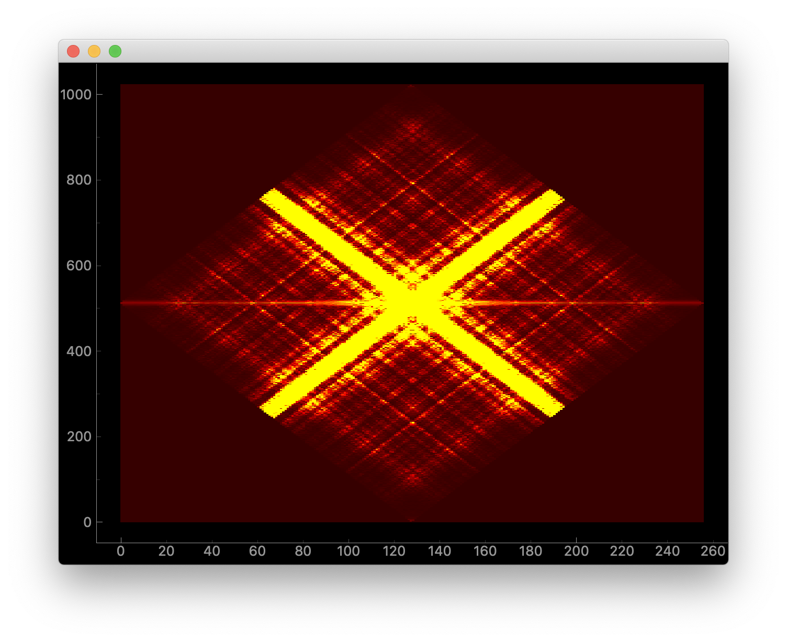

# cyclostationary 

Implementation of cyclostationary analysis:

requirements.txt - dependencies
audiosample.npy  - sample array to verify computation
scf_fam.py       - estimates Spectral Correlation Function (SCF) using FFT accumulation (FAM) method
livescf.py       - reads from microphone and plots scf using pyqtgraph

To verify: 
~~~
python scf_fam.py # should print "Error  0.0" on console and plot graph
~~~

To acquire audio from microphone and plot scf:
~~~
python livescf.py
~~~

